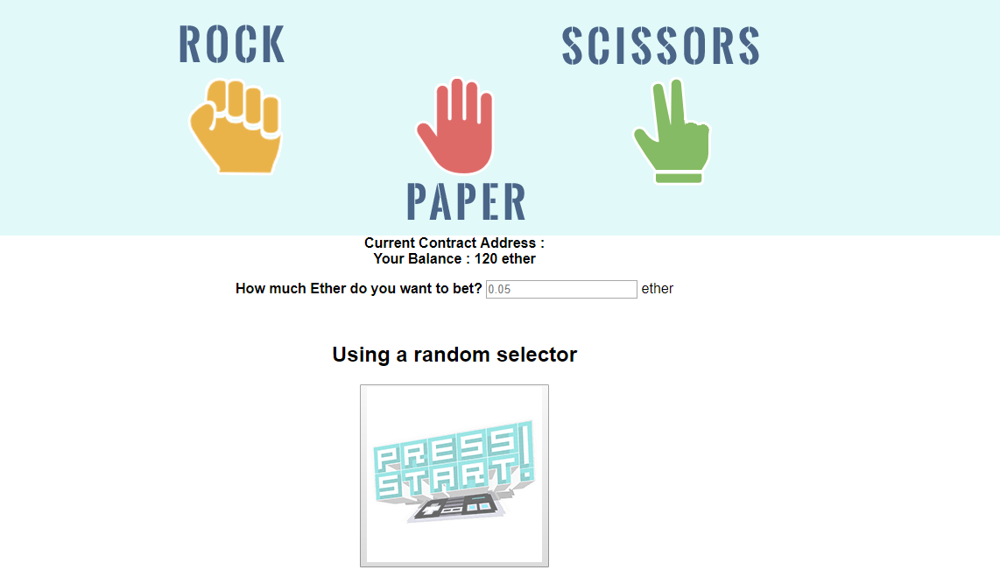

# RockPaperSizz Dapp Game 

This QuizGame is a midterm project for the Decentralized Application Course by Siraj Raval.

Author : Brian Goodwin

School of AI - Midterm assignment (https://www.theschool.ai/courses/take/decentralized-applications/texts/3406499-decentralized-game-midterm-project)

A very simple better game based on the classic game Rock Paper and Scissors which keeps score on the ethereum blockchain.

## Requires 
- Metamask
- Truffle
- Ganache
- NodeJS

## How To Run

### ethereumjs-testrpc

In a console

cd \rock-paper-sizz\

In the project directory, you can run:

### `node -v`
### `npm -v`

If either of these commands go unrecognized, visit Nodejs.org and download the appropriate installer. Run it through all of the default options.
Once finished, close and reload your console and re-run the commands above. They should now provide you with version numbers.
Next, let's use NPM to install the Ethereumjs-testrpc:

### `npm install -g ethereumjs-testrpc`

Once finished, run the following command to start it:

### `testrpc`

This provides you with 10 different accounts and private keys, along with a local server at localhost:8545.

Leave this window open!

### How to Test the Solidy code using Truffle (Optional)

cd %EXTRACTEDPATH%\rock-paper-sizz\
`truffle.cmd compile`

`truffle.cmd migrate`

`truffle.cmd test`

## Running The App

cd %EXTRACTEDPATH%\rock-paper-sizz\
### `npm start`
This will open a website that shows the game.

## Reference

This project was bootstrapped with [Create React App](https://github.com/facebookincubator/create-react-app).

Below you will find some information on how to perform common tasks. 
You can find the most recent version of this guide [here](https://github.com/facebookincubator/create-react-app/blob/master/packages/react-scripts/template/README.md).

